Title: Build and Deploy a NodeJS & Express App  
Subheadline: How to build & deploy NodeJS application.  
Date: 2015-10-26 13:00  
CleanDate: November 13, 2015  
Slug: build-and-deploy-a-nodejs-app  
Author: Zack Chase  
Avatar:  
HeaderImage:  
HeaderImageAlt:  
Summary: Learn how to build and deploy a Nodejs app with Distelli.  

  
  <strong>Zack Chase</strong>
  October 26, 2015

Node.js is a very powerful runtime environment for developing serverside web applications. It is used to create I/O intensive web applications such as video streaming and single page sites. Deploying these apps can take time, and this is where Distelli comes in. Distelli can automate the entire Build/Deploy process and even create one seamless method of deploying all of your apps, regardless of the language they are written in! For today, we will just focus on getting your Distelli Account set up and deploying your first Node.js application. 

### Prerequisites

For this tutorial you should have a working knowledge of Javascript, Basic Shell Commands, and a basic understanding of Node.js. You will also need to have a GitHub or BitckBucket account. Please make sure you have your Source Control account set up before we begin the tutorial.

### Set-Up

For this tutorial we will be using a basic "Hello World" Node.js app, but you can use your own custom application if you like. To start you are going to need to open your terminal and navigate to the folder where you would like to store your files. For myself, I am going to navigate to my WorkSpace (ws) and further more to my Source (src) directory. Then I am going to make a directory called nodeTutorial to store my Node.js app, create the actual app file, and then finally open in it in your favorite text editor. 

        $ cd ws/src
        $ mkdir nodeTutorial
        $ cd nodeTutorial
        $ touch app.js

Now that we have everything all set up we can start by creating a basic Node.js "Hello World" app. Simply open app.js in your text editor and paste in the below code:

        var express = require('express');
        var app = express();

        app.get('/', function(req, res){
          res.send('Hello World');
        });

        var server = app.listen(3000, function(){
          console.log('Magic is happening on port 3000')
        });

You will notice that I have included "express" as a Node Module. Make sure you have express installed by going to your terminal, making sure you are still in the directory where you are storing your files, and type `npm install express`. Once you have done that save app.js and run it in your terminal. As a reminder, you run a Node.js app by using the command `node app.js`. Open your browser and point it towards 'localhost:300'. This is what you should see:

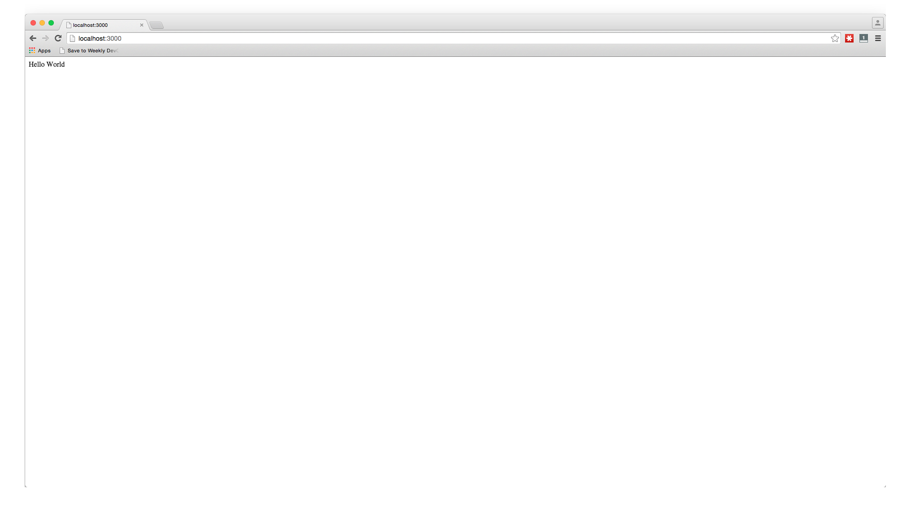

See wasn't that easy? Now that we have a working Node application all we have to do is deploy it to our server. Distelli makes this process incredibly easy and painless. Instead of having to write custom scripts to deploy your application, Distelli will do it all for you. Only a few clicks and your deployment will be live and ready for your customers! Below are the simple steps you need to follow to get your application from being hosted locally to your production server.

Before we move on, make sure you have set up a repository in GitHub or BitBucket. For this tutorial I created a repo called node-tutorial in GitHub.

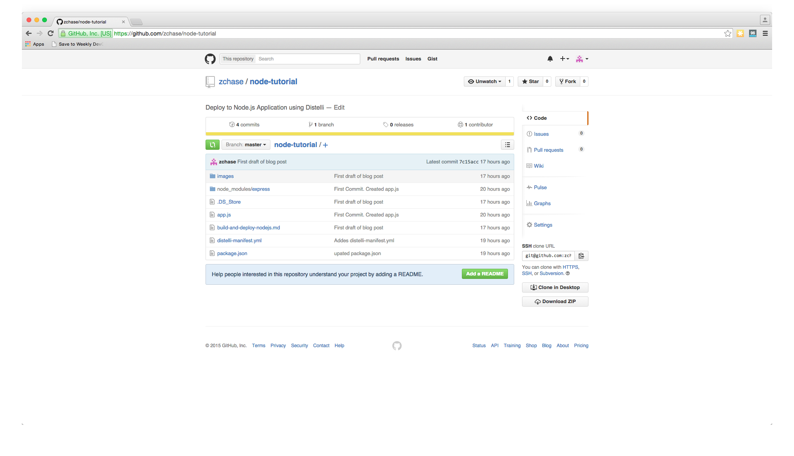

## Step 1. Push your Code to GitHub/BitBucket

For this tutorial I am using GitHub as my repository, but you can use BitBucket as well without any issue. First you will need to create a repo in GitHub and push your code to that repository. Once it is created, open your terminal and make sure you are in the directory that your app code is in.

Initialize the local directory as a Git Repo
>        $ git init

Add the files in your new local repo
>        $ git add .

Commit the files you have just staged
>        $ git commit -m "First Commit. Created app.js"

Navigate to your GitHub or BitBucket Repo and find your remote repository URL. Once you have your remote repository URL use the following commands to finish setting up your repo.

        $ git remote add origin "Your Remote Repository URL"
        # Sets the new URL
        $ gir remote -v
        # Verifies the URL

Now push the changes to your repo
        $git push origin master

Now  we have our GitHub/BitBucket repo all set up. Yet there is still one more thing we have to do before we set up our app on Distelli and get it deployed into production. Go back to your terminal and enter the command `npm init`. Follow the prompts and afterwards you should now have a package.json file in your directory. Once that file has been created push the update into your GitHub Rep.

        $ git add .
        $ git commit -m "Added package.json"
        $ git push origin master

We are now ready to move on to the next step, setting up our server.

## Step 2. Set Up Your Server

The next step in deploying our app is a very important one, make sure you have a server to run your application on. You can use any type of server - public cloud, private cloud or physical. Distelli will let you deploy your code to  Vagrant VMs or servers in a VPC. You can even deploy to the server under your desk.

For this tutorial I am going to be deploying to a server hosted by Digital Ocean. If you already have your server set you can skip to the next step. 

To get your server set up on Digital Ocean, you will need to navigate to <a href="https://www.digitalocean.com/" target="_blank">digitalocean.com</a> to get set up. If you already have an acount please Log In, if not Sign Up for an account now. Once you have created an account, or logged in, you will need to "Create Droplet". 

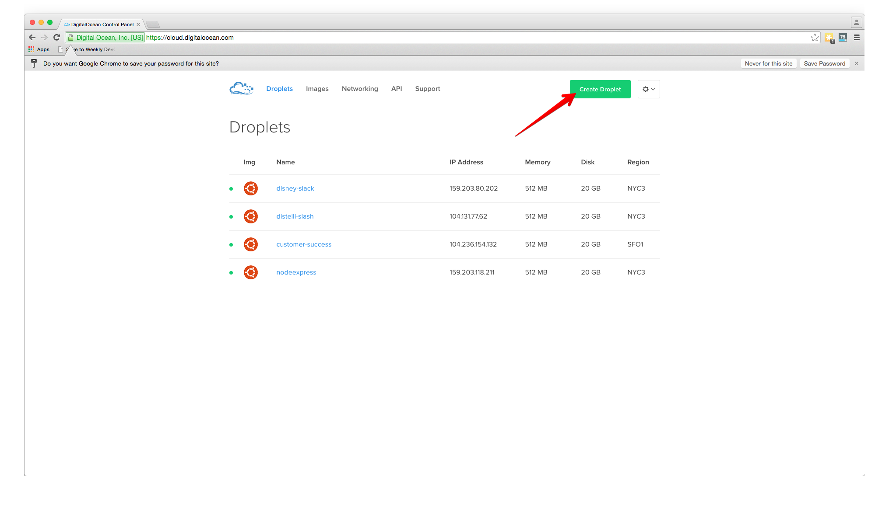

Please select the settings for your droplet that best fit your needs. I am using an Ubuntu image set up in New York. You can choose any options that you please as Distelli is able to deploy to any server, anywhere!

Once you have created your droplet we are ready to move on to the next step: installing the Distelli agent on your server!

## Step 3. Install the Distelli Agent on your Server

Now that we have a server running and ready to be deployed to, we can set up now set up Distelli to deploy our application. To start off you will need to create a Distelli account. Navigate to <a href="https://www.distelli.com/" target="_blank">distelli.com</a> and press the 'Sign Up' button in the upper right corner.

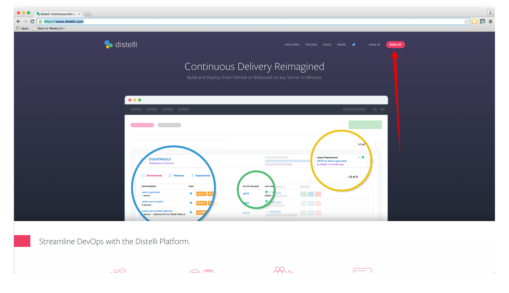

Now that we are all set up with Distelli we can install the agent on our sever. First we need to SSH into our Server. To do this we enter the following command into our terminal:

        $ ssh root@'IP Address of Server'

Now you will be prompted for the password to your server. If you used Digital Ocean, like I have, when you set up your server Digital Ocean should have send you an email containing the password to that server. If you didn't use Digital Ocean, please enter the password to the server that you configured. Now that we have access to our server, we can install the Distelli Agent onto it:

<h3>Linux and MAC OS X</h3>

To install on Linux or MAC OS X, you can use either curl <b>or</b> wget with one of the following syntaxes.
<h4>wget example</h4>

        wget -qO- https://www.distelli.com/download/agent/install | sh

<h4>curl example</h4>

        curl -sSL https://www.distelli.com/download/agent/install | sh

<h3>Windows</h3>

To install on Windows, copy and paste the following powershell command into a command (cmd) window.

        powershell -NoProfile -ExecutionPolicy Bypass -Command "iex ((new-object net.webclient).DownloadString('https://www.distelli.com/download/cli/install.ps1'))" & SET PATH=%PATH%;%ProgramFiles%\Distelli

You will prompted to enter the email and password associated with your Distelli Account. After that it will prompt you to choose your team. After you get through the prompts you can check the install of the Agent with the command `dagent status`. If your Server is running the Distelli Agent we are ready to deploy our application, if you are running into issues please consult the Distelli Docs for help at, <a href="https://www.distelli.com/docs/getting-started/installing-the-agent" target="_blank">Install the Distelli Agent</a>

## Step 4. Add your Application to Distelli

Now that we have installed the Distelli Agent on your server, we are ready to deploy our app. Navigate to <a href="https://www.distelli.com/" target="_blank">Distelli.com</a> and make sure you are logged in. Once you are logged in, go the Applications Page and click the 'New App' button.

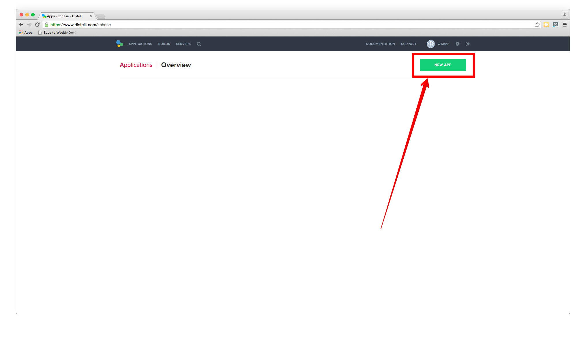

Name your app and then select the Repository you would like to connect to. As a reminder, we have been using GitHub as our repository

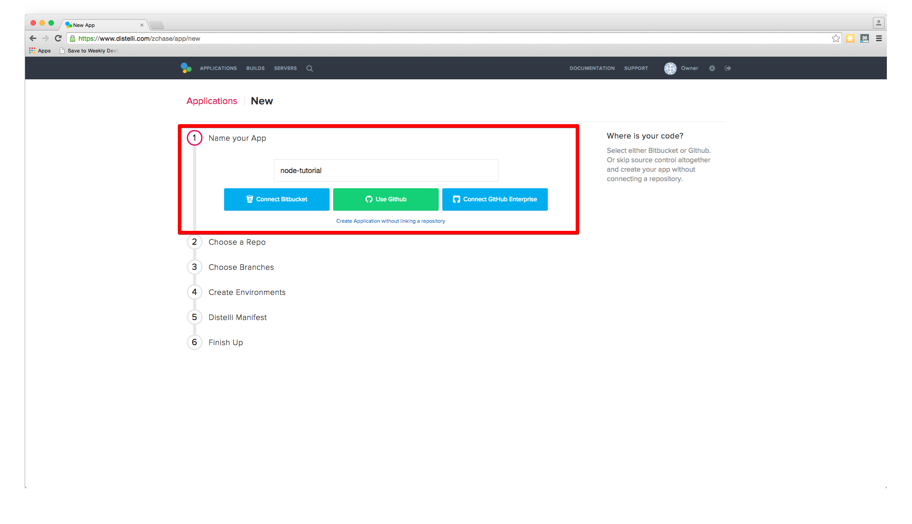

After we click the button to conenct to our Repository, we then select the appropriate repo that contains our code. In this example I store my code in the repo name 'node-tutorial'. Make sure to select the repo we set up earlier in the tutorial.

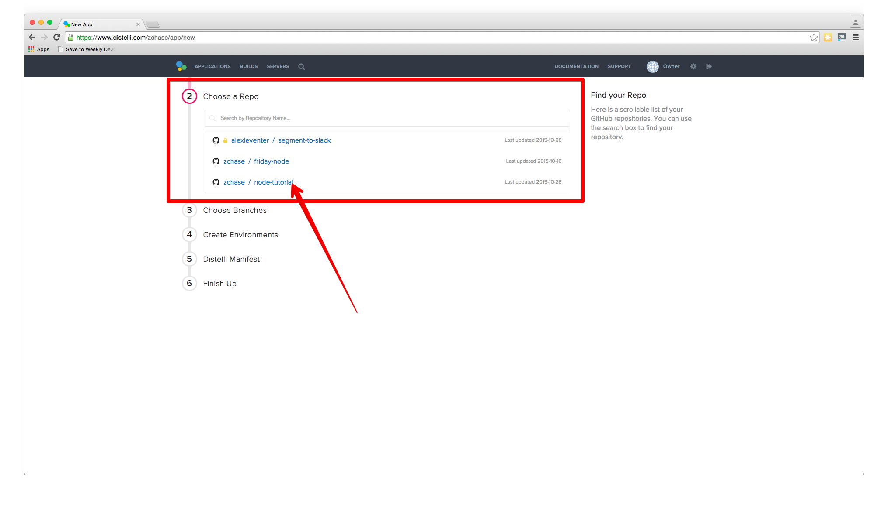

Then select the appropraite branch for your deployment. I only have a master branch, but you can deploy any branch from your repo!

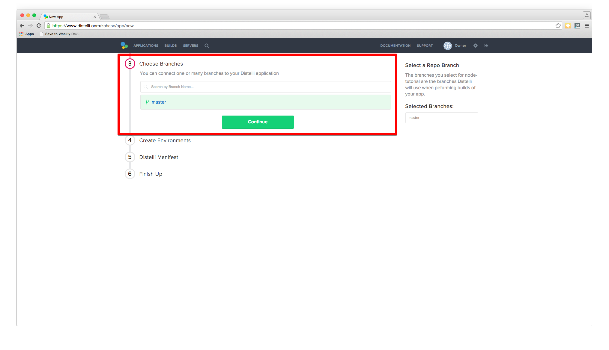

Now that we have selected our branch, Distelli will ask to create our environments. As default Disteli will create a beta and production environment. You can just press "All Done" to move to the next step. We will be deploying our production environment, but you can see how Distelli can help manage your deployments and make sure you only put the code you want into production.

Now Distelli will prompt you to download the manifest file. Make sure you select the Javascript Version of the manifest, as our code is written in Javascript. You will need this file to correctly build and deploy your applicaion. Download the file and then open in your favorite text editor. We will need to make the following changes:

      PkgInclude:
          - '*'

        PkgExclude:
          - node_modules/

        PreRelease:
          - npm install

        PreInstall:
          - sudo apt-get update
          - sudo apt-get install nodejs -y
          - sudo apt-get install npm -y

        PostInstall:
          - npm install

        Exec:
          - /usr/bin/nodejs app.js

When you make these changes to your manifest file, you will have to make sure all of spacing and indentation lines up or you will encounter an error when building/deploying. Now that we have made the necessary changes to our manifest file we can push these updates into our repo and continue with our deployment. As reminder here is how we push these changes:

        $ git add .
        $ git commit -m "Added distelli-manifest.yml"
        $ git push origin master

Now that we have pushed the changes, we can select the "I've pushed my Repo" button on our Distelli page.

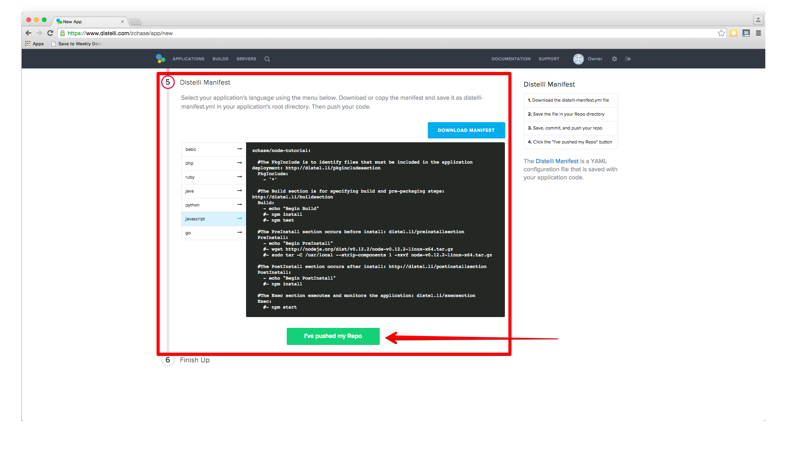

The final step is select our Build Image. In this case we are going to select "Distelli Javascript (Docker)" for our Node.js App. Select the "Auto Build" checkbox and the the "Looks good. Start Build!".

Now our build should be automatically building. You can watch its progress in the builds tab on your Distelli account. You should see that your build has sucessfully been built and is now ready to deploy.

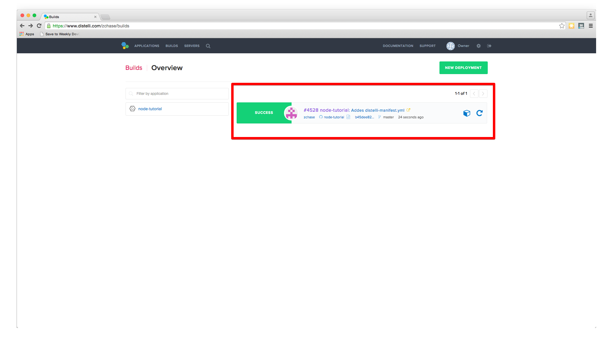

## Step 5. Deploy Your Build

Now that we successfully built our application we are ready to deploy to our server. On the builds page select the "New Deployment" button in the right hand corner. 

Once you click the button, you should be directed towards Distelli's deployment page. The first step is select the "Deploy a Release" option.

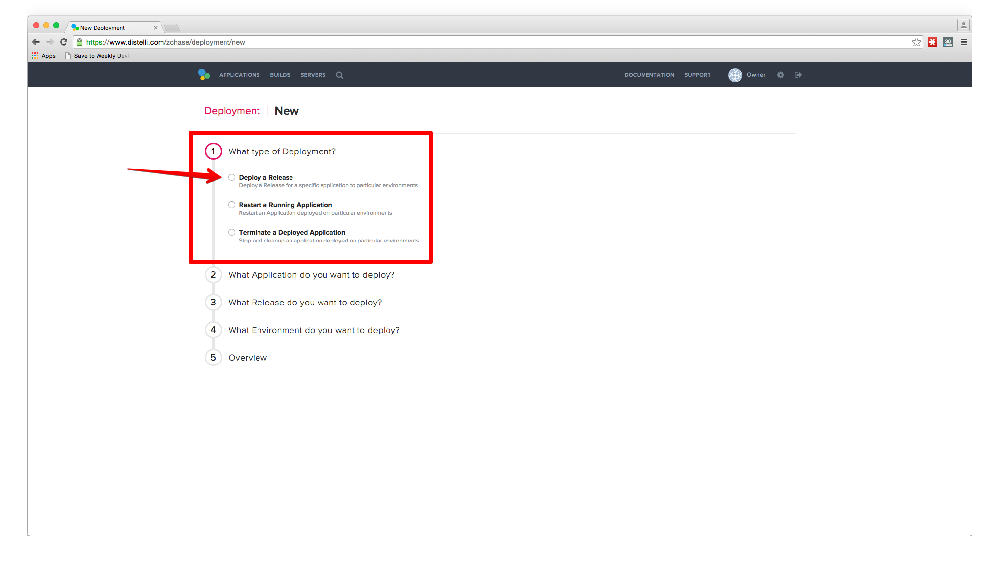

Distelli will now prompt you to select the application you want to deploy. Please select the application we created earlier in the tutorial. For my purposes, my application is "node-tutorial".

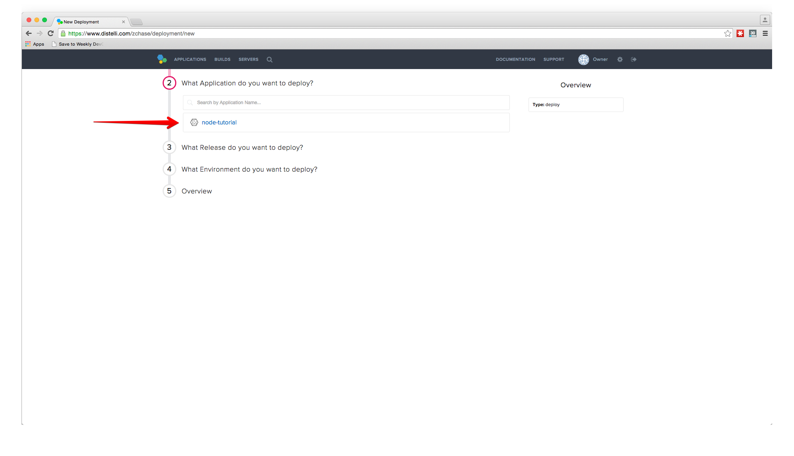

Then you will be asked to select the release you would like to deploy. For now there should only be one release for deployment.

The last step in our deployment is to select the environment you wish to deploy in. For this tutorial, I will be deploying to our production environment, but for your purposes you can select whichever environment you please.

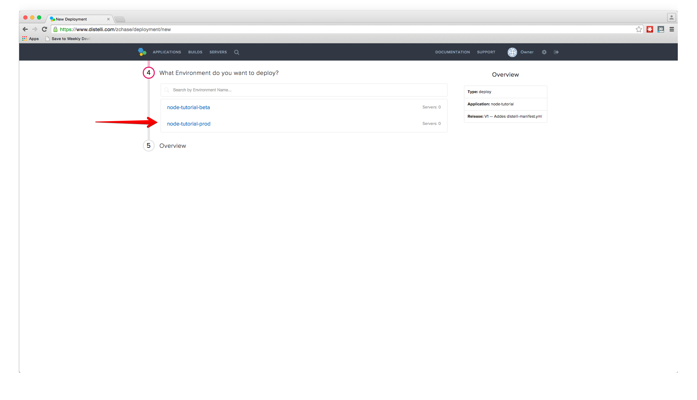

After the Deployment settings are all set up, Distelli will ask you to add your servers. Click on the "Add Servers" button to get started. Select the server you configured earlier in the tutorial and add them to your account. Once you have added your server, you can close the "Add Servers" panel and continue with your deployment. You will see a final option to set your delay between deployments on your servers and a "Start Deployment" button.

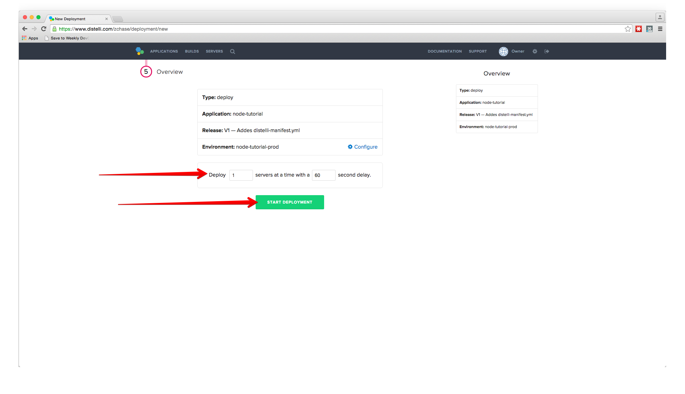

Click the "Start Deployment" button to begin your deployment. You will redirected to a page where you can view the progress of your deployment. There is a "log" button on the left side that enables you to view the logs of your deployment. Once you deployment is done you should see a screen like the one below.

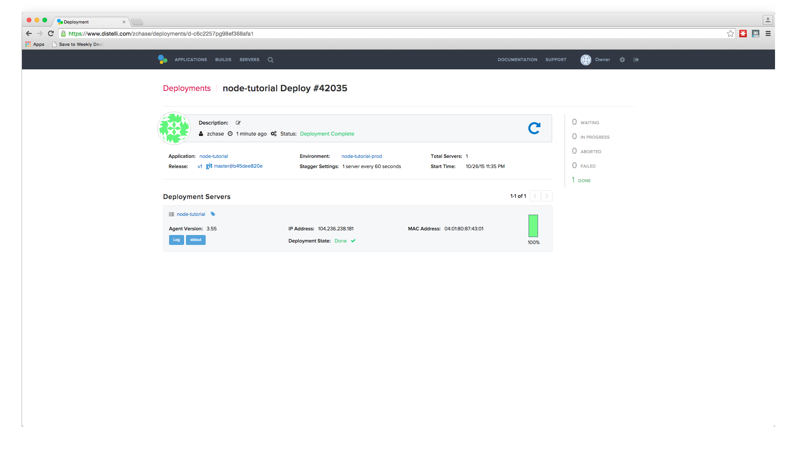

And that's it! You should now be able to point your browser to "You Server's IP Address:3000" and see the "Hello World" text displayed! 

Thank you for following along, and I hope that you have learned how Distelli can simplify the process behind deploying your Node.js applications to your servers. 
